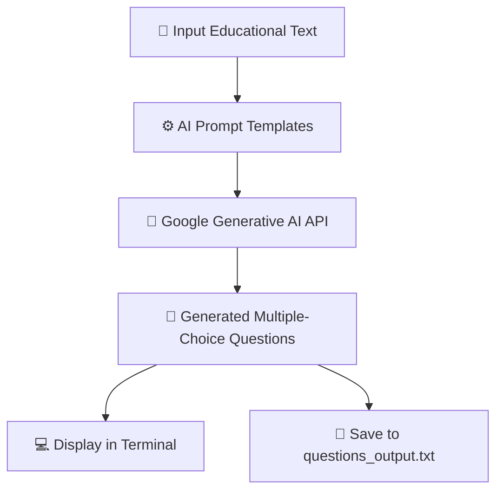

# 🤖 Automatic Question Generator

**An AI Engineering Project by Peterson Rafael Chiquetto de Camargo**

[](https://www.python.org/)
[](https://ai.google.dev/)
[]()
[]()

This project is an **AI Engineering solution** built to demonstrate how **Generative AI** can transform **educational technology (EdTech)**.
It processes an **educational text** and automatically generates **multiple-choice questions**, supporting students with interactive study and active recall.

---

## 🧩 System Overview

The application is designed with **clean architecture** and **separation of concerns**, ensuring maintainability, scalability, and extensibility.

```
📂 Project Structure
├── core/
│   └── ai_generator.py      # Main AI service module
├── utils/
│   └── file_handler.py      # File management utilities
├── question_generator.py    # Application entry point (orchestrator)
├── prompts.py               # Centralized AI prompt templates
├── requirements.txt         # Project dependencies
└── .env.example             # Example environment variables
```

---

## 📊 Flow Diagram



---

## ⚙️ Tech Stack

* 🐍 **Python 3.11+**
* 🌐 **Google Generative AI API** (`gemini-1.5-flash-latest`)
* 📦 **Libraries**: `google-generativeai`, `python-dotenv`

---

## 🚀 Getting Started

### 1️⃣ Extract the Project

Unzip the files into a folder of your choice.

### 2️⃣ Open a Terminal

Navigate to the project folder via PowerShell, CMD, or your preferred terminal.

### 3️⃣ Create & Activate Virtual Environment

```bash
# Create virtual environment
python -m venv venv

# Activate (Windows PowerShell)
.\venv\Scripts\Activate.ps1
```

### 4️⃣ Install Dependencies

```bash
pip install -r requirements.txt
```

### 5️⃣ Configure Environment Variables

* Get a valid **Google AI Studio API Key**.
* Copy **`.env.example`** → rename it to **`.env`**.
* Replace `YOUR_API_KEY_HERE` with your real key.

### 6️⃣ Run the Application

```bash
python question_generator.py
```

The app will:
✔️ Read the input text (`lesson_text.txt`)
✔️ Generate multiple-choice questions
✔️ Display them in the terminal
✔️ Save results to (`questions_output.txt`)

---

## 🧠 Why This Project Matters

This project demonstrates core principles of **AI Engineering** applied to **EdTech**:

* 🏛️ **Clean & Modular Architecture** → Easy to maintain and extend.
* 🎯 **Applied Generative AI** → Effective use of prompt engineering for NLP tasks.
* 📚 **Education-Oriented** → Automates question creation, enhancing teaching and learning.

---

## 🛠️ Roadmap

Here are potential improvements and next steps to expand this project:

* [ ] 🌐 **Web Interface**: Build a simple front-end for uploading text and visualizing questions in real time.
* [ ] 📊 **Question Export**: Export generated questions to Google Forms, PDF, or CSV formats.
* [ ] 🎨 **Question Types**: Extend beyond multiple-choice to include true/false, short answer, and essay-style questions.
* [ ] 🧩 **LMS Integration**: Integrate with Learning Management Systems (e.g., Moodle, Canvas).
* [ ] ⚡ **Batch Processing**: Support multiple documents at once with bulk question generation.
* [ ] 🧪 **Evaluation Metrics**: Add AI-driven scoring to assess question quality and difficulty levels.

---

## 🌍 Use Cases

This project can be applied to several real-world contexts:

* 👩‍🏫 **Teachers & Schools**: Automate quiz creation to save time and diversify assessments.
* 📱 **EdTech Platforms**: Integrate AI-powered question generation to enhance interactive learning.
* 🏢 **Corporate Training**: Generate evaluation material for workshops, onboarding, and compliance training.
* 🎓 **Self-Learners & Students**: Use as a personal study assistant for active recall and revision.
* 📚 **Publishing & Content Creators**: Enhance e-books and online courses with automatically generated practice questions.
